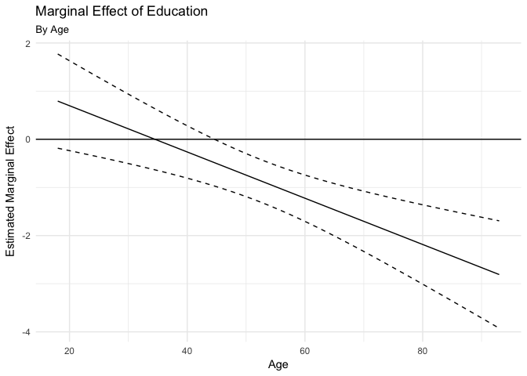

PS3 Hodgepodge
================
HyungJin Cho
05/15/2017

1.Regression diagnostics
------------------------

### a)Test the model to identify any unusual and/or influential observations. Identify how you would treat these observations moving forward with this research. Note you do not actually have to estimate a new model, just explain what you would do. This could include things like dropping observations, respecifying the model, or collecting additional variables to control for this influential effect.

    ##       id                biden         female          age      
    ##  Length:2323        Min.   :  0   Min.   :0.00   Min.   :18.0  
    ##  Class :character   1st Qu.: 50   1st Qu.:0.00   1st Qu.:33.0  
    ##  Mode  :character   Median : 60   Median :1.00   Median :47.0  
    ##                     Mean   : 62   Mean   :0.57   Mean   :47.4  
    ##                     3rd Qu.: 85   3rd Qu.:1.00   3rd Qu.:59.0  
    ##                     Max.   :100   Max.   :1.00   Max.   :93.0  
    ##                     NA's   :460                  NA's   :46    
    ##       educ           dem            rep      
    ##  Min.   : 0.0   Min.   :0.00   Min.   :0.00  
    ##  1st Qu.:12.0   1st Qu.:0.00   1st Qu.:0.00  
    ##  Median :13.0   Median :0.00   Median :0.00  
    ##  Mean   :13.1   Mean   :0.43   Mean   :0.19  
    ##  3rd Qu.:15.0   3rd Qu.:1.00   3rd Qu.:0.00  
    ##  Max.   :17.0   Max.   :1.00   Max.   :1.00  
    ##  NA's   :11     NA's   :33     NA's   :33

<table style="width:99%;">
<caption>Table continues below</caption>
<colgroup>
<col width="23%" />
<col width="19%" />
<col width="19%" />
<col width="18%" />
<col width="18%" />
</colgroup>
<thead>
<tr class="header">
<th align="center">id</th>
<th align="center">biden</th>
<th align="center">female</th>
<th align="center">age</th>
<th align="center">educ</th>
</tr>
</thead>
<tbody>
<tr class="odd">
<td align="center">Length:1807</td>
<td align="center">Min. : 0.0</td>
<td align="center">Min. :0.000</td>
<td align="center">Min. :18.0</td>
<td align="center">Min. : 0.0</td>
</tr>
<tr class="even">
<td align="center">Class :character</td>
<td align="center">1st Qu.: 50.0</td>
<td align="center">1st Qu.:0.000</td>
<td align="center">1st Qu.:34.0</td>
<td align="center">1st Qu.:12.0</td>
</tr>
<tr class="odd">
<td align="center">Mode :character</td>
<td align="center">Median : 60.0</td>
<td align="center">Median :1.000</td>
<td align="center">Median :47.0</td>
<td align="center">Median :13.0</td>
</tr>
<tr class="even">
<td align="center">NA</td>
<td align="center">Mean : 62.2</td>
<td align="center">Mean :0.553</td>
<td align="center">Mean :47.5</td>
<td align="center">Mean :13.4</td>
</tr>
<tr class="odd">
<td align="center">NA</td>
<td align="center">3rd Qu.: 85.0</td>
<td align="center">3rd Qu.:1.000</td>
<td align="center">3rd Qu.:59.5</td>
<td align="center">3rd Qu.:16.0</td>
</tr>
<tr class="even">
<td align="center">NA</td>
<td align="center">Max. :100.0</td>
<td align="center">Max. :1.000</td>
<td align="center">Max. :93.0</td>
<td align="center">Max. :17.0</td>
</tr>
</tbody>
</table>

<table style="width:39%;">
<colgroup>
<col width="19%" />
<col width="19%" />
</colgroup>
<thead>
<tr class="header">
<th align="center">dem</th>
<th align="center">rep</th>
</tr>
</thead>
<tbody>
<tr class="odd">
<td align="center">Min. :0.000</td>
<td align="center">Min. :0.000</td>
</tr>
<tr class="even">
<td align="center">1st Qu.:0.000</td>
<td align="center">1st Qu.:0.000</td>
</tr>
<tr class="odd">
<td align="center">Median :0.000</td>
<td align="center">Median :0.000</td>
</tr>
<tr class="even">
<td align="center">Mean :0.432</td>
<td align="center">Mean :0.205</td>
</tr>
<tr class="odd">
<td align="center">3rd Qu.:1.000</td>
<td align="center">3rd Qu.:0.000</td>
</tr>
<tr class="even">
<td align="center">Max. :1.000</td>
<td align="center">Max. :1.000</td>
</tr>
</tbody>
</table>

Observation Treatment: n/a values are dropped from the dataset to test a model.

### b)Test for non-normally distributed errors. If they are not normally distributed, propose how to correct for them.

    ##          term estimate std.error statistic   p.value
    ## 1 (Intercept) 68.62101   3.59600    19.083 4.337e-74
    ## 2         age  0.04188   0.03249     1.289 1.975e-01
    ## 3      female  6.19607   1.09670     5.650 1.864e-08
    ## 4        educ -0.88871   0.22469    -3.955 7.941e-05

<table style="width:86%;">
<colgroup>
<col width="25%" />
<col width="15%" />
<col width="18%" />
<col width="13%" />
<col width="13%" />
</colgroup>
<thead>
<tr class="header">
<th align="center"> </th>
<th align="center">Estimate</th>
<th align="center">Std. Error</th>
<th align="center">t value</th>
<th align="center">Pr(&gt;|t|)</th>
</tr>
</thead>
<tbody>
<tr class="odd">
<td align="center"><strong>age</strong></td>
<td align="center">0.04188</td>
<td align="center">0.03249</td>
<td align="center">1.289</td>
<td align="center">0.1975</td>
</tr>
<tr class="even">
<td align="center"><strong>female</strong></td>
<td align="center">6.196</td>
<td align="center">1.097</td>
<td align="center">5.65</td>
<td align="center">1.864e-08</td>
</tr>
<tr class="odd">
<td align="center"><strong>educ</strong></td>
<td align="center">-0.8887</td>
<td align="center">0.2247</td>
<td align="center">-3.955</td>
<td align="center">7.941e-05</td>
</tr>
<tr class="even">
<td align="center"><strong>(Intercept)</strong></td>
<td align="center">68.62</td>
<td align="center">3.596</td>
<td align="center">19.08</td>
<td align="center">4.337e-74</td>
</tr>
</tbody>
</table>

<table style="width:85%;">
<caption>Fitting linear model: biden ~ age + female + educ</caption>
<colgroup>
<col width="20%" />
<col width="30%" />
<col width="11%" />
<col width="22%" />
</colgroup>
<thead>
<tr class="header">
<th align="center">Observations</th>
<th align="center">Residual Std. Error</th>
<th align="center"><em>R</em>2</th>
<th align="center">Adjusted <em>R</em>2</th>
</tr>
</thead>
<tbody>
<tr class="odd">
<td align="center">1807</td>
<td align="center">23.16</td>
<td align="center">0.02723</td>
<td align="center">0.02561</td>
</tr>
</tbody>
</table>

    ##          term estimate std.error statistic   p.value
    ## 1 (Intercept) 573.3384   39.9047    14.368 2.118e-44
    ## 2         age   0.7513    0.3605     2.084 3.729e-02
    ## 3      female  66.9703   12.1700     5.503 4.272e-08
    ## 4        educ  -9.5516    2.4934    -3.831 1.321e-04

<table style="width:86%;">
<colgroup>
<col width="25%" />
<col width="15%" />
<col width="18%" />
<col width="13%" />
<col width="13%" />
</colgroup>
<thead>
<tr class="header">
<th align="center"> </th>
<th align="center">Estimate</th>
<th align="center">Std. Error</th>
<th align="center">t value</th>
<th align="center">Pr(&gt;|t|)</th>
</tr>
</thead>
<tbody>
<tr class="odd">
<td align="center"><strong>age</strong></td>
<td align="center">0.7513</td>
<td align="center">0.3605</td>
<td align="center">2.084</td>
<td align="center">0.03729</td>
</tr>
<tr class="even">
<td align="center"><strong>female</strong></td>
<td align="center">66.97</td>
<td align="center">12.17</td>
<td align="center">5.503</td>
<td align="center">4.272e-08</td>
</tr>
<tr class="odd">
<td align="center"><strong>educ</strong></td>
<td align="center">-9.552</td>
<td align="center">2.493</td>
<td align="center">-3.831</td>
<td align="center">0.0001321</td>
</tr>
<tr class="even">
<td align="center"><strong>(Intercept)</strong></td>
<td align="center">573.3</td>
<td align="center">39.9</td>
<td align="center">14.37</td>
<td align="center">2.118e-44</td>
</tr>
</tbody>
</table>

<table style="width:85%;">
<caption>Fitting linear model: biden_2 ~ age + female + educ</caption>
<colgroup>
<col width="20%" />
<col width="30%" />
<col width="11%" />
<col width="22%" />
</colgroup>
<thead>
<tr class="header">
<th align="center">Observations</th>
<th align="center">Residual Std. Error</th>
<th align="center"><em>R</em>2</th>
<th align="center">Adjusted <em>R</em>2</th>
</tr>
</thead>
<tbody>
<tr class="odd">
<td align="center">1807</td>
<td align="center">257</td>
<td align="center">0.02779</td>
<td align="center">0.02617</td>
</tr>
</tbody>
</table>

Test for Non-Normally Distributed Errors: The distribution is left-skewed. To correct it, power transformation of 1.5 for the `biden` variable was applied.

### c)Test for heteroscedasticity in the model. If present, explain what impact this could have on inference.

    ## 
    ##  studentized Breusch-Pagan test
    ## 
    ## data:  MOD_1
    ## BP = 23, df = 3, p-value = 5e-05

The results of the Breusch-Pagan test show that the null hypothesis of homoskedastic standard errors is rejected. This means that heteroscedasticity exists. This may impact a decrease in reliance on estimated standard error by the regression model.

### d)Test for multicollinearity. If present, propose if/how to solve the problem.

The results show that the correlations between variables are low. This indicates there is no multicollinearity problem.

2.Interaction terms
-------------------

### a)Evaluate the marginal effect of age on Joe Biden thermometer rating, conditional on education. Consider the magnitude and direction of the marginal effect, as well as its statistical significance.

    ##          term estimate std.error statistic   p.value
    ## 1 (Intercept) 38.37351    9.5636     4.012 6.254e-05
    ## 2         age  0.67187    0.1705     3.941 8.431e-05
    ## 3        educ  1.65743    0.7140     2.321 2.038e-02
    ## 4    age:educ -0.04803    0.0129    -3.723 2.029e-04

<table style="width:86%;">
<colgroup>
<col width="25%" />
<col width="15%" />
<col width="18%" />
<col width="13%" />
<col width="13%" />
</colgroup>
<thead>
<tr class="header">
<th align="center"> </th>
<th align="center">Estimate</th>
<th align="center">Std. Error</th>
<th align="center">t value</th>
<th align="center">Pr(&gt;|t|)</th>
</tr>
</thead>
<tbody>
<tr class="odd">
<td align="center"><strong>age</strong></td>
<td align="center">0.6719</td>
<td align="center">0.1705</td>
<td align="center">3.941</td>
<td align="center">8.431e-05</td>
</tr>
<tr class="even">
<td align="center"><strong>educ</strong></td>
<td align="center">1.657</td>
<td align="center">0.714</td>
<td align="center">2.321</td>
<td align="center">0.02038</td>
</tr>
<tr class="odd">
<td align="center"><strong>age:educ</strong></td>
<td align="center">-0.04803</td>
<td align="center">0.0129</td>
<td align="center">-3.723</td>
<td align="center">0.0002029</td>
</tr>
<tr class="even">
<td align="center"><strong>(Intercept)</strong></td>
<td align="center">38.37</td>
<td align="center">9.564</td>
<td align="center">4.012</td>
<td align="center">6.254e-05</td>
</tr>
</tbody>
</table>

<table style="width:85%;">
<caption>Fitting linear model: biden ~ age + educ + age * educ</caption>
<colgroup>
<col width="20%" />
<col width="30%" />
<col width="11%" />
<col width="22%" />
</colgroup>
<thead>
<tr class="header">
<th align="center">Observations</th>
<th align="center">Residual Std. Error</th>
<th align="center"><em>R</em>2</th>
<th align="center">Adjusted <em>R</em>2</th>
</tr>
</thead>
<tbody>
<tr class="odd">
<td align="center">1807</td>
<td align="center">23.27</td>
<td align="center">0.01756</td>
<td align="center">0.01592</td>
</tr>
</tbody>
</table>

    ## Linear hypothesis test
    ## 
    ## Hypothesis:
    ## age  + age:educ = 0
    ## 
    ## Model 1: restricted model
    ## Model 2: biden ~ age + educ + age * educ
    ## 
    ##   Res.Df    RSS Df Sum of Sq    F Pr(>F)    
    ## 1   1804 985149                             
    ## 2   1803 976688  1      8461 15.6  8e-05 ***
    ## ---
    ## Signif. codes:  0 '***' 0.001 '**' 0.01 '*' 0.05 '.' 0.1 ' ' 1

The results show that marginal effect of age goes down when education goes up. The hypothesis test indicates the marginal effect is not significant at the education of 13 to 16.

### b)Evaluate the marginal effect of education on Joe Biden thermometer rating, conditional on age. Consider the magnitude and direction of the marginal effect, as well as its statistical significance.

    ## Linear hypothesis test
    ## 
    ## Hypothesis:
    ## educ  + age:educ = 0
    ## 
    ## Model 1: restricted model
    ## Model 2: biden ~ age + educ + age * educ
    ## 
    ##   Res.Df    RSS Df Sum of Sq    F Pr(>F)  
    ## 1   1804 979537                           
    ## 2   1803 976688  1      2849 5.26  0.022 *
    ## ---
    ## Signif. codes:  0 '***' 0.001 '**' 0.01 '*' 0.05 '.' 0.1 ' ' 1

The results show that marginal effect of education goes down when education goes up. The hypothesis test indicates the marginal effect is not significant at the age under 45.

3.Missing data
--------------

    ## -- Imputation 1 --
    ## 
    ##   1  2  3  4
    ## 
    ## -- Imputation 2 --
    ## 
    ##   1  2  3  4  5  6
    ## 
    ## -- Imputation 3 --
    ## 
    ##   1  2  3  4  5
    ## 
    ## -- Imputation 4 --
    ## 
    ##   1  2  3  4  5  6
    ## 
    ## -- Imputation 5 --
    ## 
    ##   1  2  3  4  5  6

    ## -- Imputation 1 --
    ## 
    ##   1  2  3  4  5  6
    ## 
    ## -- Imputation 2 --
    ## 
    ##   1  2  3  4  5
    ## 
    ## -- Imputation 3 --
    ## 
    ##   1  2  3  4  5
    ## 
    ## -- Imputation 4 --
    ## 
    ##   1  2  3  4  5
    ## 
    ## -- Imputation 5 --
    ## 
    ##   1  2  3  4  5  6

    ##          term estimate std.error estimate.mi std.error.mi
    ## 1 (Intercept) 68.62101   3.59600    67.38818      3.82963
    ## 2         age  0.04188   0.03249     0.04821      0.03713
    ## 3      female  6.19607   1.09670     6.08994      1.34015
    ## 4        educ -0.88871   0.22469    -0.82705      0.25005

Missing values occur highly in the variable `baiden`. Log transformation to `age` and squared-root transformation to `biden` were applied for Amelia's Multiple Imputation. The results show that absolute value of the intercept and parameter of `female`, `educ` decreased with a higher standard error and parameter of `age` increased with a lower standard error in an imputed model compared to the original, non-imputed model.
